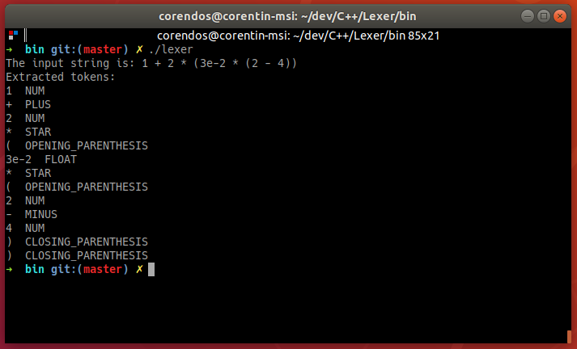

# Lexer

## Description
This is a repository containing my implementation of a lexer, based on the following lecture:
[Basics of Compiler Design](http://hjemmesider.diku.dk/~torbenm/Basics/basics_lulu2.pdf)

## Screenshots (example)

## How it works ?
As a training, I decided to decompose the global lexic into basic lexics. In the first screenshot for example, there are 4 lexics (available in the resource folder as json files):
- `identifier_lexic.json` represents the NFA that detects identifiers.
- `operator_lexic.json` represents the NFA that detects operators.
- `num_lexic.json` represents the NFA that detects non-float numbers.
- `float_lexic.json` represents the NFA that detects floating points numbers.

These lexics are then combined into one and the resulting NFA is converted to a DFA that will be used in the token extraction process.

## Todo
- [x] NFA to DFA transformation  
- [x] Detecting tokens  
- [x] File loading  
- [x] File saving  
- [x] Write documentation  
- [x] Report lexical errors instead of terminating the program  
- [ ] Use a better structure to represent token types  
- [ ] Add more infos to the tokens payload  
- [ ] Clean the code  
- [ ] (Not really related) Write the complete set of tokens for the test language  
- [ ] Graph optimization  

